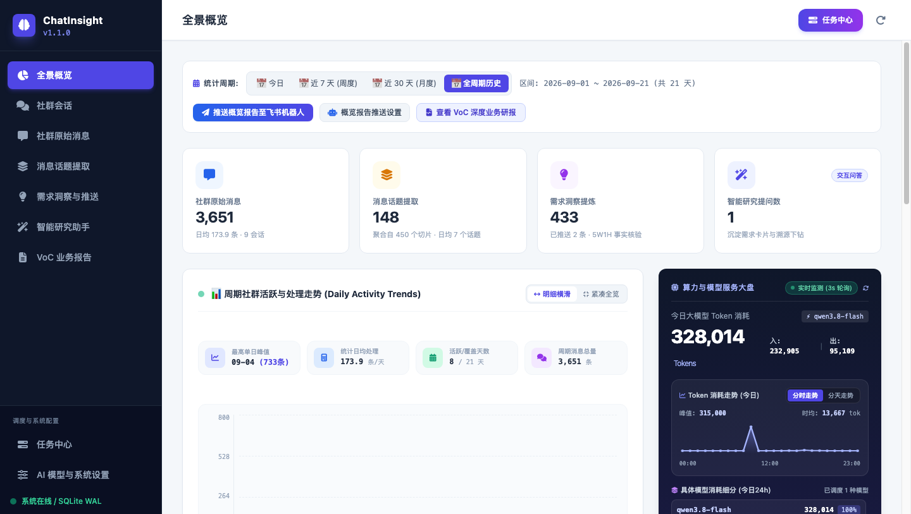
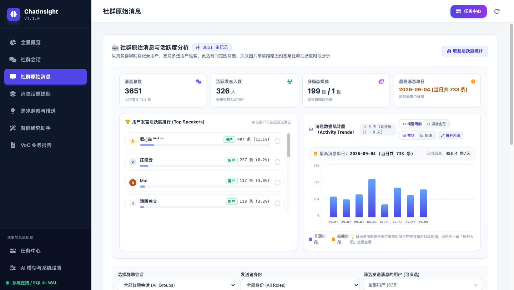
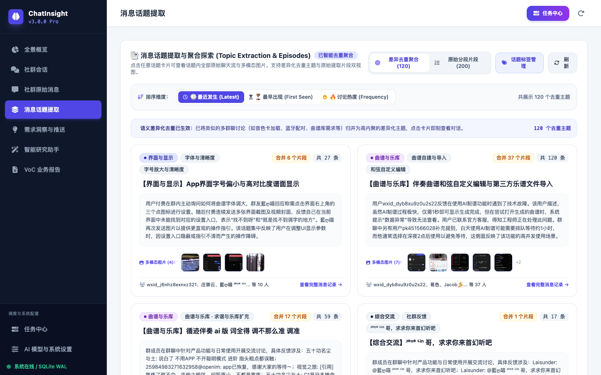
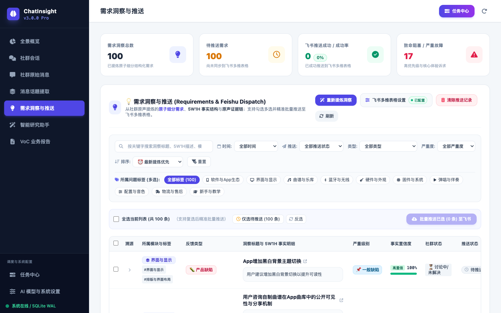
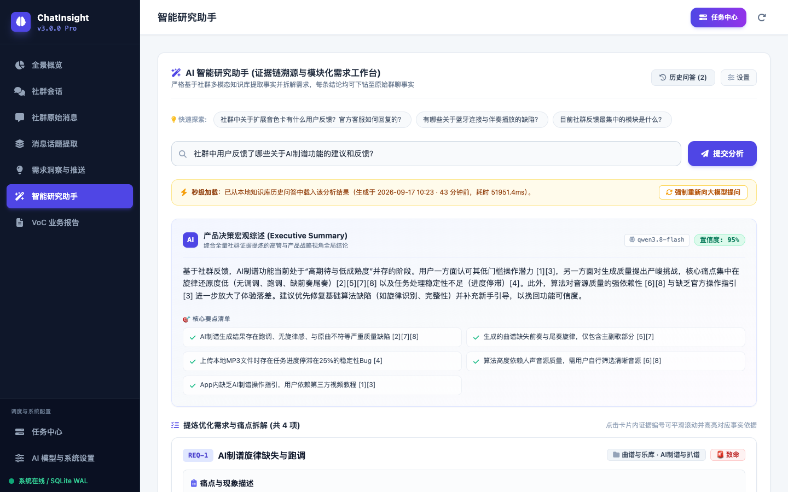
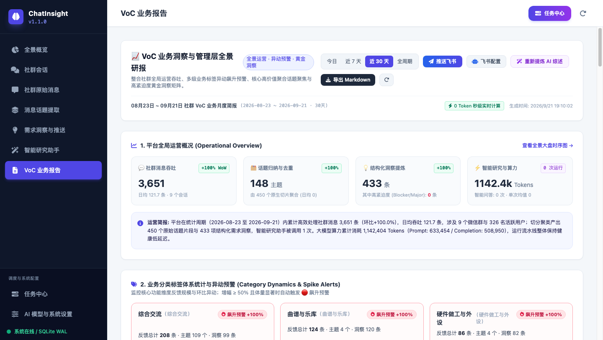
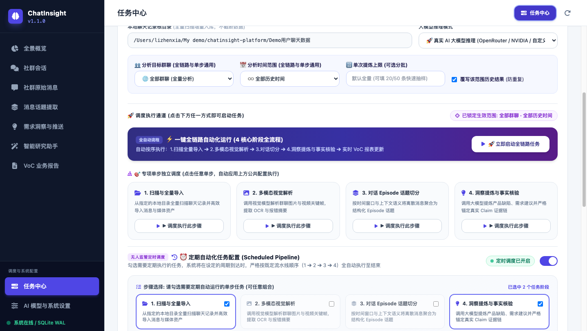

# ChatInsight Platform (多模态社群反馈洞察与智能决策系统)

> **专为硬件产品与软硬一体生态打造：面向微信等社群导出的多模态反馈解析、细粒度微话题挖掘、5W1H 事实链防幻觉核验、两阶段智能去重聚类、带可溯源引用的 AI 研究助手与飞书协同平台。**

<p align="center">
  <a href="https://www.python.org/"></a>
  <a href="https://fastapi.tiangolo.com/"></a>
  <a href="https://v3.vuejs.org/"></a>
  <a href="https://www.sqlite.org/"></a>
  <a href="https://openrouter.ai/"></a>
  <a href="./LICENSE"></a>
  <a href="https://chatinsight-demo.onrender.com"></a>
  <a href="https://github.com/sniperXIA/ChatInsight-Platform/releases/tag/v1.1.0"></a>
  <a href="https://github.com/sniperXIA/ChatInsight-Platform"></a>
</p>

> 🚀 **线上免部署体验 (Live Demo)**：
> 欢迎访问 Render 免费托管的实时演示站点：**[https://chatinsight-demo.onrender.com](https://chatinsight-demo.onrender.com)**  
> *(注：已内置 3,651 条脱敏社群真实语料与完整 5W1H 洞察研报；基于 Render 免费实例托管，如遇冷休眠状态首次加载约需 30 秒)*

---

## 💡 致谢与开源灵感来源 (Acknowledgements & References)

ChatInsight Platform 的诞生与架构设计离不开开源社区优秀思想的滋养。在系统规划与开发演化过程中，特别参考并致谢以下两个优秀的开源项目：

1. 🌟 **[My Context](https://github.com/)**
   - **灵感与参考**：ChatInsight 的“**上下文核心（Context Core）**”架构设计与社群原始数据摄入流水线深度参考了 My Context 的思想。
   - **关键借鉴模块**：
     - **高容错状态机解析**：处理非结构化微信聊天导出格式（TXT）、换行、引用消息解析及编码纠错。
     - **多模态时间戳隐式消歧**：实现图片、短视频与群聊文字按时间轴关联的媒体解析消歧机制。
     - **确定性脱敏机制**：采用基于空间的 HMAC-SHA256 算法实现用户 ID 与敏感信息的单向匿名化。

2. 🌟 **[ABC Feedback](https://github.com/)**
   - **灵感与参考**：ChatInsight 的“**用户反馈分类体系（Taxonomies）**”与“**企业协同工单闭环**”参考了 ABC Feedback 的领域模型。
   - **关键借鉴模块**：
     - **企业级反馈契约标准**：建立了覆盖功能缺陷（Bug）、功能建议（Feature）、产品咨询（Inquiry）、表扬认可（Praise）的标准 SVO 数据结构。
     - **事务性 Outbox 事件同步机制**：保障了本地事实知识库与外部平台（如飞书多维表格 Feishu Bitable）之间双向同步的高可靠与幂等性。

---

## 📜 彻底开源与商业化自由承诺 (Open Source & Commercial License)

本项目是一个**彻底开源、对商业极其友好**的开源项目：

- **开源协议**：本项目基于极为宽松的 **[MIT License](./LICENSE)** 完全开放所有源代码。
- **商业化权利**：**任何个人、创业团队或商业公司，均可自由免费地将本项目用于任何商业化产品、自建企业私有平台、二次开发、二次分发或闭源商用，无需支付任何授权费用或版税。**
- **唯一要求**：仅需在您的项目分发、衍生产品或源代码副本中，遵循 MIT 协议保留原始的版权声明与许可副本即可。

---

## 🌟 解决的核心业务痛点

在消费级智能硬件（如智能无弦吉他、智能穿戴、影音数码）与互联网产品运营中，大量最真实的“第一现场用户声音”往往沉睡在海量的社群（微信群、企业微信、Telegram、Discord）中。然而，传统人工收集或简单的通用 RAG 检索面临着极其严峻的工程与业务挑战：

| 痛点场景 | 传统做法的缺陷 | ChatInsight 的创新解法 |
|---|---|---|
| **微信导出乱** | 微信 TXT 导出格式极不稳定、表情换行混杂、系统提示穿插，极易解析中断。 | **状态机自愈扫描器**，自动纠正编码异常，完美提取用户回复与引用链。 |
| **多模态割裂** | 用户发图问“这灯怎么不亮了？”，传统文本大模型完全丢失画面与 OCR 信息。 | **Qwen-2.5-VL 视觉/OCR 提取 + FFmpeg 关键帧时间轴还原**，图文统一组装为 Context Packet。 |
| **大模型幻觉与误判** | 大模型常把客服说的“已知/我们看下”误判为“故障已解决”，把偶发咨询放大为严重故障。 | **5W1H 事实链原子 Claim 校验机制**，强制绑定聊天 URI，严格区分 `support_acknowledged` 与 `fix_confirmed`。 |
| **海量同质反馈泛滥** | 几千条社群消息中，几百人问同一个问题，若直接喂给大模型会导致海量 Token 浪费与主题混乱。 | **两阶段聚类（Stage 1 向量/N-Gram 召回 + Stage 2 LLM 裁判归并）**，实现去重与热度聚合。 |
| **知识沉淀与流转脱节**| 聊完即忘，无法沉淀为知识库，更无法对接研发部门的任务看板或飞书表格。 | **带 Citation 引用的 AI 决策工作台 + 飞书多维表格（Bitable）一键/批量同步**。 |

---

## 🖥️ 系统主要功能与运行时全景展示

ChatInsight 提供了完备的单页控制台（SPA），涵盖从底层数据导入到顶层决策分析的完整产品体验：

### 1. 全景数据概览与大模型算力监控看板 (Overview & LLM Ops)
实时聚合展示社群消息吞吐量、提取话题数、结构化洞察量、用户活跃走势图，以及底层大模型/视觉模型的实时 Token 消耗统计与吞吐速度大盘。



- **核心数据卡片**：展示日均吞吐、周环比增长、去重话题与洞察沉淀数。
- **活跃走势时序图**：按日期/小时统计社群讨论峰值，支持横滑与时段下钻。
- **算力大盘时分走势联动**：支持【分时走势 (今日24h)】与【分天走势 (近7天)】实时响应式联动切换，动态同步今日/近7天的输入 Prompt、输出 Completion 与总 Token 消耗。
- **飞书多维表格流转看板**：严格限定仅展示统计周期内真实发生过推送的记录，彻底杜绝待推送项占位，并支持周期感知空状态与一键跳转。

---

### 2. 社群原始消息与多模态解析工作台 (Multimodal Timeline)
还原社群聊天真实时间轴，支持图片 OCR、视频截图展示、发言排行榜下钻与多维筛选。



- **多模态画廊**：群聊内图片、截图及视频抽帧缩略图直接嵌入消息流，支持原图点击预览与全键盘快捷缩放。
- **发言活跃度榜单**：展示社群内高频发言用户排名，支持一键筛选指定核心用户的全部历史发言。
- **灵活筛选器**：支持按群聊来源、发言人角色、时间区间与正文关键字即时检索。

---

### 3. 会话情节切分与原子微话题提取 (Topic Extraction & Episodes)
基于滑动时间窗口与上下文语义智能切分社群对话，提取细粒度、低幻觉的“原子微话题”，支持差异去重聚合。



- **极简陈述式微话题**：直接以最客观直白的表述呈现讨论核心（如 `【界面与显示】App界面字号偏小与高对比度谱面显示`）。
- **差异去重与聚合视图**：支持在“差异去重聚合（去重主题）”与“原始分段片段（200+ 原始对话切片）”之间无缝切换。
- **多模态资产透视**：每个话题卡片直观标明归并的片段数、发言条数、关联图片张数及参与用户列表。

---

### 4. SVO 需求洞察提炼与 5W1H 事实链核验 (Insights & Feishu Dispatch)
将聊天内容提炼为标准 SVO（主语-谓语-宾语）与 5W1H 结构化需求，并与飞书多维表格（Feishu Bitable）无缝双向打通。



- **主谓宾 (SVO) 结构化清洗与智能去重**：自动剔除低质口语化前缀与重复后缀，提炼核心主谓宾语义，避免同质洞察堆积。
- **设备型号智能感知与打标**：自动识别用户反馈中涉及的具体硬件机型（如 `iPhone 15 Pro Max`、`小米14 Ultra`），支持按机型进行组合过滤与统计。
- **5W1H 事实链与防幻觉**：包含清晰的角色、触发场景、诉求、影响度，并附带 100% 置信度事实依据与原文溯源。
- **飞书多维表格推送审计手风琴**：支持展开查看每一次向飞书推送的流水日志、HTTP 响应状态与流转记录。

---

### 5. 证据链溯源智能研究助手 (AI Research Assistant with Citations)
面向产品经理、用户研究员、技术支持的严谨决策分析工作台。回答严格基于社群多模态知识库事实，杜绝空泛胡编。



- **双通道 RAG 检索融合 (Dual-Channel Hybrid Search)**：支持自定义 Dense 向量稠密检索网关与 BM25 稀疏词频检索的 RRF 互惠重排融合，大幅提升细分专业术语与偶发故障的召回率。
- **产品决策宏观综述 (Executive Summary)**：提供针对特定功能的高管层与战略视角结论及置信度评分。
- **强制可追溯证据链引用 (Citation Tags)**：每一个核心结论均强绑定 `[1]`, `[2]`, `[3]` 等原文引用角标，点击即可联动高亮对应的社群原始事实证据。
- **模块化需求拆解与历史归档**：输出标准 REQ 格式需求清单，所有问答秒级缓存并支持关键字快速检索。

---

### 6. VoC 周期研报自动生成与异动预警 (VoC Report & Anomaly Spikes)
自动聚合统计周期内的社群运营全景、多级业务标签飙升预警矩阵，并支持一键导出 Markdown 格式周报。



- **真实系统日历时间绑定**：周期时间（今日、近7日、近30日、全周期）严格按当前日历时间动态对齐，坚决移除历史假定回退逻辑。
- **零数据周期防幻觉治理**：在今日与近7天无新增消息时，客观陈述事实并提供科学的常规运营监控建议，杜绝大模型编造虚假故障。
- **全量业务深度聚合**：近30天与全周期模式下聚合 3,600+ 条真实社群消息、140+ 个话题与 400+ 条洞察，准确输出 16 个业务分类异动预警、重点高价值话题（综合热度 98.0）与落地建议。
- **一键 Markdown 导出与飞书机器人推送**：支持将研报一键下发至运营群机器人或导出为企业知识库文档。

---

### 7. 自动化定时调度中心 (Scheduled Tasks & Continuous Pipeline)
打造面向无人监管场景下的企业级定时自动化流水线，实现社群运营与洞察提炼的常态化闭环。



- **4 核心阶段精简流水线**：将端到端流程标准化归纳为「1. 扫描与全量导入 ➔ 2. 多模态视觉解析 ➔ 3. 对话 Episode 话题切分 ➔ 4. 洞察提炼与事实核验」，支持一键全自动执行或专项单步调度。
- **无人监管定时调度器 (Scheduled Pipeline)**：内置可视化 Cron 调度配置器，支持按每天、每周、每月自定义触发时间与执行阶段，并精准计算预测下一次运行时间（Next Run At）。
- **实时作业状态感知与生命周期管理**：提供作业实时心跳监控、后台协程健康守护、执行日志查看与一键安全启停。

---

## 🏗️ 系统技术架构设计

ChatInsight 采用轻量、高可靠、松耦合的工业级后端架构：

```
+-----------------------------------------------------------------------------------+
|                        ChatInsight Platform 架构全景                              |
+-----------------------------------------------------------------------------------+
                                        |
  [ 原始微信社群导出文件 / 拍照 / 截屏 / 短视频 (TXT/JPG/PNG/MP4) ]
                                        |
                                        v
+-----------------------------------------------------------------------------------+
| 1. 扫描预检与幂等导入 (packages/importers)                                        |
|    * DirectoryScanner: 阻断性编码探测与文件树结构预检                             |
|    * LegacyTxtParser: 状态机容错解析、换行合并、引用关系溯源                      |
|    * MediaResolver: 显式/隐式文件名与时间戳多模态消歧与关联                       |
|    * BatchImporter: 增量 SHA256 幂等写入 SQLite WAL                               |
+-----------------------------------------------------------------------------------+
                                        |
                                        v
+-----------------------------------------------------------------------------------+
| 2. 多模态富化流水线 (packages/media_pipeline & model_gateway)                     |
|    * ImagePipeline: EXIF 自动校正 + Qwen-2.5-VL 视觉描述与 OCR 提取              |
|    * VideoPipeline: FFprobe 探测 + FFmpeg 关键帧智能抽样与视觉摘要合成            |
|    * AnalysisRun 缓存: 输入与配置双重 SHA256 哈希审计 (零重复调用开销)             |
+-----------------------------------------------------------------------------------+
                                        |
                                        v
+-----------------------------------------------------------------------------------+
| 3. 会话情节切分与 Claim 事实核验 (packages/insights)                              |
|    * EpisodeSegmenter: 25 分钟滑动窗口切分 + 多模态上下文 Context Packet 组装     |
|    * InsightExtractor: 提炼 issue / feature / inquiry / praise 结构化 SVO 洞察    |
|    * FactualChecker: 原子 Claim 证据链匹配 (chatinsight://... URI) 事实一致性打分 |
|    * 状态区分: 严谨隔离客服已知 (support_acknowledged) 与真实修复 (fix_confirmed) |
+-----------------------------------------------------------------------------------+
                                        |
                                        v
+-----------------------------------------------------------------------------------+
| 4. 两阶段智能聚类与知识库沉淀 (packages/clustering & feishu_bitable)              |
|    * Stage 1: CandidateRanker (模块划分 + 语义向量 / n-gram 相似度快速召回)       |
|    * Stage 2: PairwiseJudge (大模型深度仲裁: SAME_ISSUE / SUB_ISSUE / DISTINCT)   |
|    * Topic 生命周期: 频次累加、用户数统计、动态代表性标题与摘要提炼               |
|    * FeishuBitableService: 事务性 Outbox 事件分发、多维表格推送与审计流水         |
+-----------------------------------------------------------------------------------+
                                        |
                                        v
+-----------------------------------------------------------------------------------+
| 5. 混合检索、研究助手问答与 VoC 报表 (packages/search, retrieval & analytics)     |
|    * VectorService & HybridSearch: Dense 稠密向量嵌入 + BM25 词频 RRF 互惠重排    |
|    * ResearchAssistant: 基于检索证据链的深度问答，强制绑定 Citation 原文角标      |
|    * ReportGenerator: 真实日历锚定、零数据防幻觉治理、分类异动预警与周报/月报导出 |
+-----------------------------------------------------------------------------------+
                                        |
                                        v
+-----------------------------------------------------------------------------------+
| 6. 无人监管定时调度与持续流水线 (packages/tasks)                                  |
|    * ScheduledTaskManager: 4 阶段自动化流水线、动态 Cron 表达式计算与守护执行     |
+-----------------------------------------------------------------------------------+
```

---

## 🚀 快速上手与本地启动

### 1. 环境准备
- **操作系统**：macOS / Linux / Windows WSL2
- **Python 版本**：Python 3.11 或更高版本
- **多媒体工具**：FFmpeg 与 FFprobe（用于视频抽帧与音频处理）
  - macOS: `brew install ffmpeg`
  - Ubuntu/Debian: `sudo apt-get install -y ffmpeg`

### 2. 获取代码与依赖安装
```bash
git clone https://github.com/sniperXIA/ChatInsight-Platform.git
cd ChatInsight-Platform

# 创建并激活虚拟环境
python3 -m venv .venv
source .venv/bin/activate  # Windows 用户使用: .venv\Scripts\activate

# 安装生产依赖
pip install -r requirements.txt
```

### 3. 配置环境变量 (`.env`)
```bash
cp .env.example .env
```
编辑 `.env` 配置您的模型网关密钥（支持 OpenRouter、DeepSeek、Qwen 等标准兼容接口）：
```ini
# OpenRouter 或其他兼容 OpenAI 格式的 API Key
OPENROUTER_API_KEY=sk-or-v1-xxxxxxxxxxxxxxxxx

# 默认视觉大模型（用于图片 OCR 与视频多模态解析）
DEFAULT_VISION_MODEL=qwen/qwen-2.5-vl-72b-instruct

# 默认文本大模型（用于话题切分、洞察提炼与智能助手问答）
DEFAULT_TEXT_MODEL=deepseek/deepseek-chat

# 数据库存储路径（默认在根目录下自动创建）
DATABASE_PATH=chatinsight.db
```

### 4. 启动服务
使用内置启动脚本或通过 uvicorn 直接启动：
```bash
# 方式 A：直接运行启动脚本
./start.sh

# 方式 B：通过 uvicorn 启动
uvicorn apps.api.main:app --host 0.0.0.0 --port 8000 --reload
```
打开浏览器访问控制台：
- **Web UI 现代化看板**：`http://localhost:8000/`
- **Swagger API 交互文档**：`http://localhost:8000/docs`
- **Redoc 接口文档**：`http://localhost:8000/redoc`

---

## 🧪 自动化测试验证

ChatInsight 具备严格的工程级质量要求，内置完整的自动化测试套件：
```bash
pytest tests/ -v
```
全套测试包含数据导入解析、多模态流水线、两阶段聚类去重、事实核验机制、飞书推送服务等共计 **112+ 个测试用例，100% 全部通过**。

---

## 💻 命令行 CLI 使用指南

除了 Web UI 外，ChatInsight 提供了功能完备的命令行工具 `cli.py`，支持自动化运维与批量脚本调度：

```bash
# 1. 一键全自动全链路流水线导入
python cli.py pipeline --path "path/to/chat_export_folder"

# 2. 独立分步执行
python cli.py scan -p "path/to/chat_export_folder"    # 预检扫描聊天目录与媒体文件
python cli.py import -p "path/to/chat_export_folder"  # 正式导入聊天记录与媒体资产
python cli.py analyze-media --limit 10                # 触发图片/视频多模态解析
python cli.py segment-episodes --limit 10             # 执行话题切分与上下文包组装
python cli.py extract-insights --limit 10             # 提炼结构化洞察与事实核验
python cli.py cluster-insights --limit 20             # 洞察两阶段聚类与主题沉淀
python cli.py search -q "音色卡"                      # 跨知识库多维混合检索
python cli.py ask-assistant --question "AI制谱功能的主要问题是什么？"  # 智能研究助手问答
python cli.py generate-report --output "voc_report.md" # 生成并导出业务洞察周报
```

---

## 🔌 核心 REST API 清单

| 业务领域 | 请求方式 | 路由接口 | 功能描述 |
|---|---|---|---|
| **Health** | `GET` | `/api/v1/health` | 平台连通性与数据库健康检查 |
| **Data Sources** | `POST` | `/api/v1/source-roots/scan` | 触发社群导出目录预检扫描 |
| **Imports** | `POST` | `/api/v1/imports/start` | 启动批次增量幂等导入 |
| **Conversations** | `GET` | `/api/v1/conversations` | 分页查询社群会话与统计 |
| **Messages** | `GET` | `/api/v1/conversations/{id}/messages` | 查询带多模态关联的消息时序流 |
| **Media** | `POST` | `/api/v1/media/{id}/analyze` | 触发单项媒体的 OCR 与视觉富化 |
| **Episodes** | `POST` | `/api/v1/conversations/{id}/segment` | 触发会话的情节与话题切分 |
| **Insights** | `POST` | `/api/v1/episodes/{id}/extract` | 提炼 5W1H 洞察与原子 Claim 证据链 |
| **Insights** | `GET` | `/api/v1/insights` | 多维筛选洞察列表（状态/模块/严重级） |
| **Topics** | `POST` | `/api/v1/insights/{id}/cluster` | 触发两阶段智能聚类归并 |
| **Topics** | `GET` | `/api/v1/topics` | 查询沉淀的知识库聚类主题 |
| **Assistant** | `POST` | `/api/v1/assistant/ask` | 智能研究助手带证据链 Citation 问答 |
| **Assistant** | `GET` | `/api/v1/assistant/history` | 查询历史研讨论证记录 |
| **Feishu Bitable**| `POST` | `/api/v1/feishu-bitable/push-selected` | 批量将已核验洞察推送到飞书多维表格 |
| **Feishu Bitable**| `GET` | `/api/v1/feishu-bitable/recent` | 查询统计周期内最近推送至飞书的流转记录 |
| **Scheduled Tasks**| `GET` | `/api/v1/tasks/scheduled-config` | 获取自动化定时流水线配置与执行状态 |
| **Scheduled Tasks**| `POST` | `/api/v1/tasks/scheduled-config` | 更新定时任务调度策略与 Cron 表达式 |
| **Scheduled Tasks**| `POST` | `/api/v1/tasks/scheduled/run-now` | 立即手动触发执行一次定时任务 |
| **Settings** | `GET` | `/api/v1/settings/embedding` | 查询当前向量嵌入模型配置与连通性测试 |
| **Analytics** | `POST` | `/api/v1/analytics/reports/generate` | 动态生成周期 VoC 深度研报 |
| **Analytics** | `GET` | `/api/v1/analytics/reports/export-markdown` | 导出 Markdown 格式周报 |

---

## 🤝 社区贡献与参与

欢迎任何形式的贡献！无论是一个错别字修正、功能建议还是大型特性 PR：
1. **Fork 本仓库**
2. **新建特性分支** (`git checkout -b feature/amazing-feature`)
3. **提交变更** (`git commit -m 'feat: Add some amazing feature'`)
4. **推送到分支** (`git push origin feature/amazing-feature`)
5. **开启 Pull Request**

---

## 📄 开源许可证

本项目采用 **MIT License** 许可证。详情参见 [LICENSE](./LICENSE) 文件。
